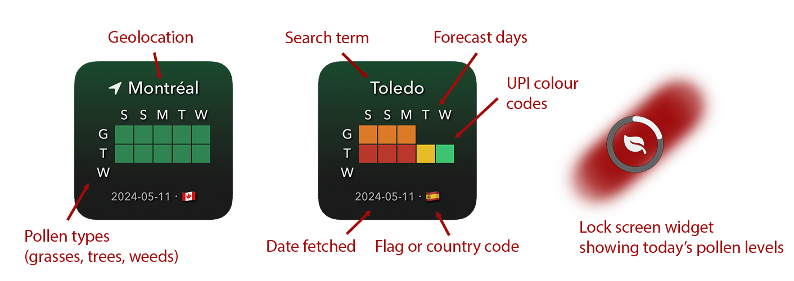
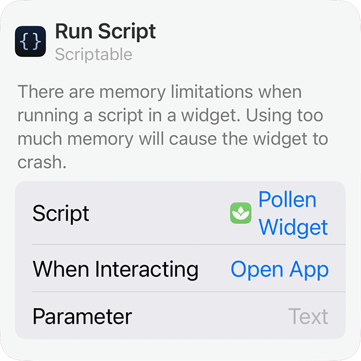

# Pollen Widget

A pollen forecast widget for use with the [Scriptable](https://apps.apple.com/us/app/scriptable/id1405459188) app in iOS.

## What this widget does

For a given location, the widget fetches up to five days of pollen forecast data from the Google Pollen API and displays it in an easy-to-read table. The location can be one of:

- your current location
- a saved location
- any other location of your choosing, such as a neighbourhood or city.

A lock screen version of the widget displays a progress circle representing current pollen levels.

**IMPORTANT: See the [Requirements](#Requirements) and the [Widget Parameter](#the-widget-parameter) sections below.**

**Note that every instance of the widget (home screen widget, lock screen widget etc.) uses its own widget parameter and makes its own API calls. This means that if multiple versions of the widget are installed and they don't all have the same widget parameter (and hence the same cached data), the script will make multiple API calls.**

## Look



The colour codes refer to the [Universal Pollen Index](https://developers.google.com/maps/documentation/pollen/pollen-index) and are represented as follows:

|            Colour             | UPI Code | Pollen Level |
| :---------------------------: | :------: | :----------: |
| $${\color{#002600}&#x25FC;}$$ |    0     |  No pollen   |
| $${\color{#2d8953}&#x25FC;}$$ |    1     |   Very low   |
| $${\color{#2ecc71}&#x25FC;}$$ |    2     |     Low      |
| $${\color{#f1c40f}&#x25FC;}$$ |    3     |   Moderate   |
| $${\color{#e67e22}&#x25FC;}$$ |    4     |     High     |
| $${\color{#c0392b}&#x25FC;}$$ |    5     |  Very High   |

The pollen types are "G" (grasses), "T" (trees), and "W" (weeds). See [here](https://developers.google.com/maps/documentation/pollen/coverage) for more information on what information is available in different countries.

## Requirements

- The [Scriptable](https://apps.apple.com/us/app/scriptable/id1405459188) app for iOS.

- Location services must be enabled for geolocation. Under <kbd>Settings</kbd>&hellip;<kbd>Privacy & Security</kbd>&hellip;<kbd>Location Services</kbd>&hellip;<kbd>Scriptable</kbd>, enable "While Using the App or Widgets".

- The Google Pollen API and the Google Geolocation API are required. Add them to a Google project, **retrieve your API key, and enter it in the first section of the script**.
  - To set up a Google project, see the guide [here](https://developers.google.com/maps/documentation/pollen/cloud-setup).
  - Billing has to be enabled and valid for the project associated with your API key.
  - At the time of writing, Google was offering $200 USD per month in free usage. Default widget usage will likely not exceed a few dollars per month, but that depends on how often you fetch new data and on current pricing. As long as you're within whatever free usage limit applies to you, you won't be billed.
  - For current pricing information, see [here](https://mapsplatform.google.com/pricing/).
  - If you already have an API key, retrieve it from your [Google Cloud Console](https://console.cloud.google.com/). (Look under <kbd>APIs and Services</kbd>&hellip;<kbd>Credentials</kbd>. Select either <kbd>Show Key</kbd>, if you already have an API key, or <kbd>Create Credentials</kbd> if you need to create one).
  - Any costs incurred by using this script are entirely the responsibility of the end user.

## Installation

For a general guide on how to install widgets in iOS, see [here](https://support.apple.com/en-ca/118610).

Make sure the [Scriptable](https://apps.apple.com/us/app/scriptable/id1405459188) app is installed on your iPhone.

Add `Pollen Widget.js` to Scriptable:

- If you have a Mac and use iCloud, the easiest way is to copy the script files to the Scriptable directory in your iCloud drive. You can do this via cURL from a MacOS terminal window:<br>
  `curl https://github.com/macdis/Pollen-Widget/blob/0e82a89af749acd4ae4369b1927918bff947d86b/Pollen%20Widget.js --output ~/Library/Mobile\ Documents/iCloud~dk~simonbs~Scriptable/Documents/Pollen\ Widget.js`
- Optionally add `Pollen Widget--Clear Cache.js` to Scriptable:<br>
  `curl https://github.com/macdis/Pollen-Widget/blob/0e82a89af749acd4ae4369b1927918bff947d86b/Pollen%20Widget--Clear%20Cache.js --output ~/Library/Mobile\ Documents/iCloud~dk~simonbs~Scriptable/Documents/Pollen\ Widget--Clear\ Cache.js`
- You can also copy the raw text of the `Pollen Widget.js` script text from [here](https://raw.githubusercontent.com/macdis/Pollen-Widget/main/Pollen%20Widget.js). Then hit the <kbd>+</kbd> icon in Scriptable ("Scripts" page, top right corner) and paste the script text into the editor window. **IMPORTANT: once you're back in the main Scriptable window, long-press the untitled script and rename it to `Pollen Widget`.**

To install the basic widget, press and hold an empty area on your home screen. Hit the <kbd>+</kbd> icon. Search for the Scriptable app and select it.

First select the widget size. The widget looks best in the "small" format (equivalent to 4x4 home screen icons).

Next, configure the new widget by tapping on it while it's in wiggle mode.

Select the script source: `Pollen Widget.js`.

Leave the widget parameter blank to use geolocation or enter a search term (i.e., a place name).

Exit to your home screen.

## Google API key

Your Google API key must be defined in one of two places:

- In `Pollen-Widget.js` (see the line `let apiKey` declaration at the top of the script)
- Or in a `Pollen Widget.json` file stored in the same directory as the widget script. `Pollen Widget.json` should look like this:

```
{
  "apiKey": "yourGoogleApiKey"
}
```

Note that if both are defined `Pollen Widget.json` takes precedence.

## How to uninstall the widget

Use the `clearcache` widget parameter (see the [Widget parameter](#the-widget-parameter) section below for more information). When you see the confirmation that the cache has been deleted, force-touch the widget and select "Remove Widget".

You can also clear the cache using the `Pollen Widget--Clear Cache.js` script from within the Scriptable app.

Finally, you can delete the widget files from the Scriptable app or iCloud.

## The widget parameter



If you force-touch the widget installed on your home screen, you can select "Edit Widget" from the pop-up menu. This will display widget options, including the "Parameter". Enter your search terms here, e.g., "Berlin" or "Toledo, Spain". You can enter pretty much anything, as you would in Google Maps. The widget will query the Google Geolocation API to get the latitude and longitude of the location entered.

For some locations, you will have to add more information. For example, "Hell's Kitchen" will not return results, but "Hell's Kitchen, NY" works fine.

There are also three special keywords you can use as the widget parameter:

- `here` (which is the same as leaving the widget parameter blank), i.e., the widget will use device-based geolocation to get your current location (requires location services).

- `saved`: this will use the information saved in the `saved` variable as your search location. (Refer to the variables at the beginning of `Pollen Widget.js`.)

- `clearcache`: this will clear the widget's cached data. Note that the widget automatically keeps its cached data tidy, deleting out of date data on the fly, so the "clearcache" option should only be needed in case of problems or before removing the widget. You can also use the `Pollen Widget--Clear Cache.js` script within the Scriptable app.

## Options

The widget works as is (using geolocation or a widget parameter search term), but is also configurable. The variables/options are all at the beginning of the `Pollen Widget.js` file. The main options are as follows:

- The widget does not have to fetch data all year long. You can set `startMonth` and `endMonth` to whatever suits your location. Outside of this period the widget will display a message but won't fetch data. Defaults: `const startMonth = 4;` and `const endMonth = 9;`

- The off-season message can be configured through the `offSeasonMessage` variable. Default: `const offSeasonMessage = "Check back next";` The message is of the form: "Check back next [startMonth]!"

- Set the number of forecast days fetched through the `days` variable. Default: `const days = 5;`

- You can configure how often the widget automatically fetches data using the `updateInterval` variable. The number entered represents the number of hours between automated API queries. Updating frequently provides no additional benefits (and may increase the cost of using the widget). Default (in hours): `const updateInterval = 4;`

- The `useFlags` Boolean variable controls whether the widget displays country flags or two-letter codes. Default: `const useFlags = true;`

- You can optionally enter a `saved` location using latitude and longitude coordinates. This location is used when you enter the keyword "saved" as the widget parameter. Default: downtown Montréal. The variable to change: `const saved = { lat: number1, lon: number2 };` where `number1` and `number2` represent latitude and longitude coordinates, respectively, expressed in decimal degrees.

- The variables `savedSFSymbol` and `hereSFSymbol` define what symbol is used for current (geolocated) and saved locations. See [Apple's SF Symbols website](https://developer.apple.com/sf-symbols/) for more information. Note that animations and other special effects are _not_ supported. Defaults: `const savedSFSymbol = "house.fill";` and `const hereSFSymbol = "location.fill";`

- The `showUPI` Boolean variable controls whether the UPI numbers (0-5) are hidden (showUPI = false) or shown (showUPI = true) along with their colour codes. Default: `showUPI = false;`

- The `myLocale` variable controls the language and regional formatting of days, dates, etc. It is automatically set to your device's default value, but you can also manually set standard locales such as "en-CA", "en-US", "fr-FR" etc.

- The `language` variable is used for Google API queries. It is automatically set to your device's default value, but you can also manually set a language such as "en", "fr" etc. Example: `const  languageCode = "fr";`

- The dimensions of table cells can be controlled to some extent via `colWidths`, but in general I would not recommend changing these values.

- You can choose your own fonts and point sizes for the widget. Refer to the list found [here](http://iosfonts.com/). No other fonts are supported. Change the `placeFont`, `tableFont`, `footerFont`, and `offSeasonFont` as desired. Note that certain choices will completely mess up the look of the widget.

- The `widgetColors` object contains a list of colours used in the widget. The numbered colours correspond to the Universal Pollen Index (UPI) scale. See [here](https://developers.google.com/maps/documentation/pollen/pollen-index) for more information on the UPI. The "official" colours are indicated in the comments in `Pollen Widget.js`, in case you prefer those. Note that a value of 0 is also possible, which means "no pollen detected". This should be distinguished from null values, which means no data was available when fetched. As defaults, I've used a very dark green (near black) for 0 and full transparency for null values.

- Finally, there's a `corrections` object that is used to 'correct' place name results from Google's Geolocation API or Apple's Reverse Geocoding API. If you don't like the name used for a particular location, for example, or if it's incorrectly spelled, you can specify a replacement term here.

## Data cache

Cached data for the current day is stored in a local documents directory on your device (not viewable in the Files app). It is not transferred to other devices. The widget automatically clears out files not from the current day. Updates according to `updateInterval` overwrite older data. Each location has a data cache of about 5-15&nbsp;KB, generally speaking. Data is stored in a single file, per search term or keyword (e.g., `pollen-toledo-spain.json`, `pollen-here.json`, etc.).

## Troubleshooting

The first thing to try is clearing the cache. Use the "clearcache" widget parameter or the `Pollen Widget--Clear Cache.js` script from within the Scriptable app.

Using more precise search terms will help to avoid geocoding errors. See the remark about geolocation in the [Limitations](#limitations) section of this document.

## A note on dates and time zones

Depending on your location and the time of day, the first time you retrieve data, the information may not be for the current day. This happens because the Google Pollen API uses UTC dates. So, for example, in the EDT time zone, the Google Pollen API starts returning data for May 7 starting on May 6 at 20:00 (because at 20:00 EDT/UTC&nbsp;-04:00 on May 6, it is already 0:00 UTC on May 7).

You may find this annoying. There isn't much the script can do about this on an initial API call. However, on later API calls, the script will retain the most recently cached data until the day changes in the time zone you're currently in.

## Limitations

1. The Google Pollen API does not cover every location on Earth. See [here](https://developers.google.com/maps/documentation/pollen/coverage) for more information.

2. The Google Geolocation API is not foolproof. If you search for "Toledo", and you mean "Toledo, Spain", you may be surprised if the results are for "Toledo, Ohio, USA". The flag or country code in the footer will provide you with a clue about the location corresponding to the pollen data. You can, of course, use more precise search terms. So, for example, you can set "Toledo, Spain" as the widget parameter, rather than just "Toledo". You can also search for addresses and neighbourhoods (though this may not work in all cases). Find the right search terms for your location. Or leave the widget parameter blank to use your current position (requires location services).

3. The widget displays summary data for available general pollen types (grasses, trees, and/or weeds) for a given region. Not all regions have data for all pollen types. The widget does not display _all_ the data that the Google API provides, such as the pollen counts for specific plant types, or descriptive information about plant types.

4. I don't know if the widget will display properly on all devices. I've only used it and tested it on an iPhone 13.

## Apologies

This is a learning project. I only started teaching myself JavaScript a couple of weeks ago for the purposes of carrying out this project, so the code is probably sloppy and not at all optimized.

## Credits

The table layout is based on [The Golf Club Widget](https://gist.github.com/supermamon/c29726374142664d1f139015801faaf7).

The lock screen progress circle is based on [progress-circle.js](https://gist.github.com/Normal-Tangerine8609/0c7101942b3886bafdc08c357b8d3f18).
